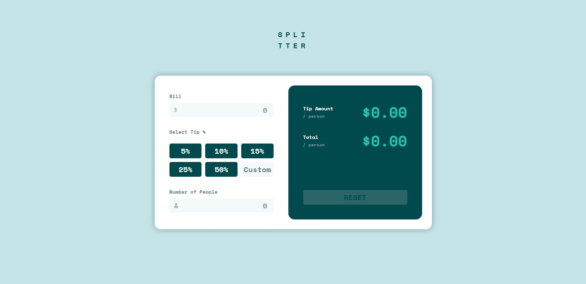
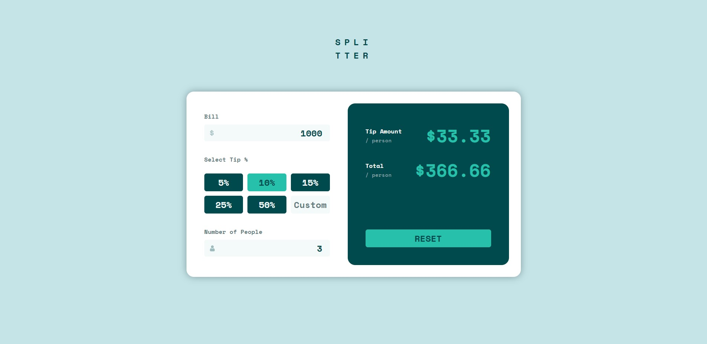
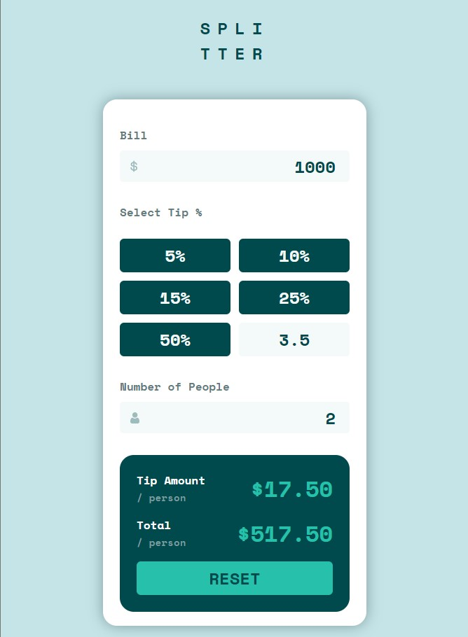

# Frontend Mentor - NFT preview card component solution

This is a solution to the [NFT preview card component challenge on Frontend Mentor](https://www.frontendmentor.io/challenges/nft-preview-card-component-SbdUL_w0U). Frontend Mentor challenges help you improve your coding skills by building realistic projects. 

## Table of contents

- [Overview](#overview)
  - [The challenge](#the-challenge)
  - [Screenshot](#screenshot)
  - [Links](#links)
- [My process](#my-process)
  - [Built with](#built-with)
  - [What I learned](#what-i-learned)
  - [Continued development](#continued-development)
  - [Useful resources](#useful-resources)
- [Author](#author)
- [Acknowledgments](#acknowledgments)

**Note: Delete this note and update the table of contents based on what sections you keep.**

## Overview

### The challenge

My users should be able to:

- Change the layout when changing display scale or using other device
- Get desired split amount per person
- Be able to add custom tip percentage if needed
- Get error display if count is invalid
- Reset the calculator

### Screenshot








### Links

- Solution URL: [Solution URL](https://github.com/SGautam1108/Tip-Calculator)
- Live Site URL: [Live site](https://sgautam1108.github.io/Tip-Calculator/)

## My process

The basic process of structuring, styling and finalizing.
Started with HTML to structure my components.
Next with CSS for styling and took a few hours to narrow down the exact styling as provided in the challenge's design images.
Since the calculator format had to be changed from laptop to mobile, multiple media queries were used for seamless display.
The Final task was to use JS for different edge cases and show Output to users!

### Built with

- Semantic HTML5 markup
- CSS and Flexbox, Grid
- BEM Methodology
- Javascript

### What I learned

The following project took a couple of days. There were quite many things to learn along the process-

1) It's a good practice to use reset.css to support older browsers as well

2) Selector Specificity: Meaning if I have specified rules in CSS for an element using tags, classes and id, then Tag > class rules > id. 
So it's better to use tag rules only for generic things which need not get changed later. Or use Javascript for inline style which might tho hamper the idea of keeping structuring, styling and functionalities separate.

3) Following code can be used to remove slider of input[type=number]

```css
  /* remove spinners for number type input */
  input[type="number"]::-webkit-inner-spin-button,
  input[type="number"]::-webkit-outer-spin-button {
      -webkit-appearance: none;
      margin: 0;
  }
```

4) There is no need to check explicitly if element contains("class-name") before adding or removing in JavaScript


### Continued development

Will try to change onblur event to onchange for input form, so that users don't need to explicitly click mouse outside input field to get output.

### Useful resources

- [Kevin Powell](https://www.youtube.com/channel/UCJZv4d5rbIKd4QHMPkcABCw) - Great CSS Ideas and frontend best practices tips


## Author

- LinkedIn - [Shaurya Gautam](https://www.linkedin.com/in/sgautam1108/)
- Frontend Mentor - [@SGautam1108](https://www.frontendmentor.io/profile/SGautam1108)
- CSSBattles.dev - [@SGautam1108](https://cssbattle.dev/player/sgautam1108)
- Github - [@SGautam1108](https://github.com/SGautam1108/)


## Acknowledgments

A Special thanks to Angela Yu, Course Instructor for "Full stack development" course at Udemy. Her course has been of a great help for me to start out with these projects on my own. Cheers to y'all!!
